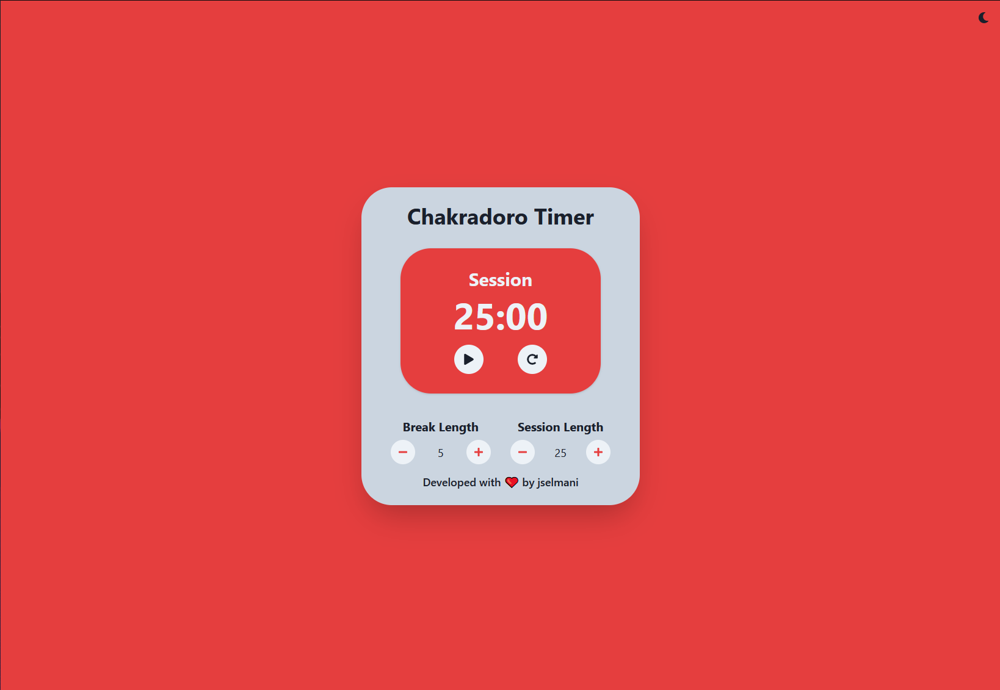

# Chakradoro Timer
> This is a small project created with the purpose of learning more about React and Chakra UI. Project was started using Create React App with the Chakra UI template.

## About this project
I structured this project using several React components and both custom and native React Hooks to handle various project features and behaviours.  The use of the Context API was to avoid prop-drilling, while the use of Chakra UI was to experiment with a design system for faster prototyping which I am happy with.  The app also has the option to choose between Light or Dark mode.

To use the app, you can set both the length of your break and the length of the session to a maximum of 60 minutes each.  Once the timer reaches 0, an audio notification will play.  Additionally, the application can be monitored from your browser tab where it follows the duration of your session or break without having to keep your eyes on the open tab.

## Demo
You can use the timer [here](https://chakradoro-timer.vercel.app/).

## Features
:heavy_check_mark: &nbsp; Chakra UI Components
:heavy_check_mark: &nbsp; Use of React Context API
:heavy_check_mark: &nbsp; Use of React Hooks, Chakra UI Hooks, and Custom Hooks
:heavy_check_mark: &nbsp; Responsive Site that can be used in Mobile format
:heavy_check_mark: &nbsp; Counter State in Browser Tab
:heavy_check_mark: &nbsp; Audio notification when Timer ends

## Technologies

 - React
 - React Hooks
 - React Context API
 - Chakra UI Design System
 - Deployed on Vercel